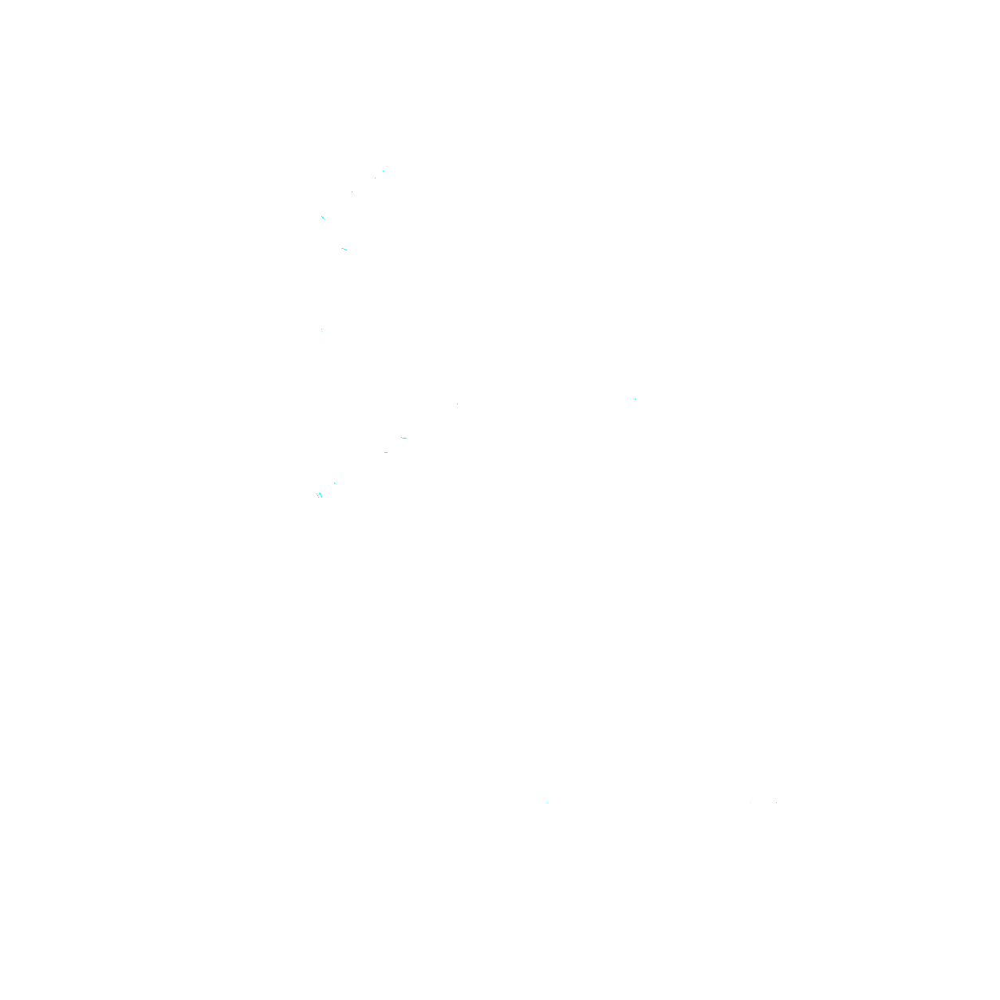
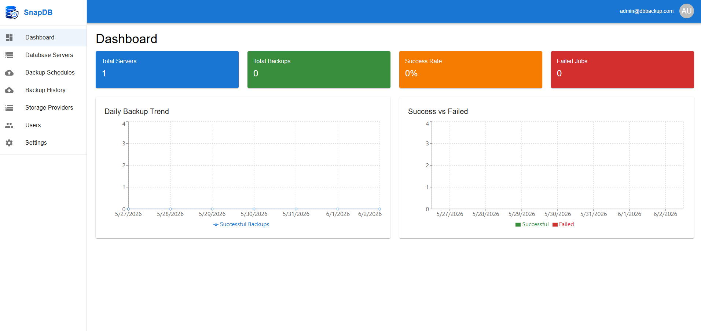

<p align="center">
  
  <br>
   <b>Database Backup Management Platform</b>
</p>
<hr>



A production-ready, Docker-supported web-based Database Backup Management Platform that allows administrators to register database servers, configure backup schedules, execute manual backups, monitor backup jobs, and manage backup storage.

## Features

### Core Features
- ✅ Multi-database support (MySQL, PostgreSQL, MongoDB, MariaDB)
- ✅ Scheduled backups with cron expressions
- ✅ Manual backup execution
- ✅ Real-time job monitoring
- ✅ Multiple storage providers (Local, SFTP, S3, MinIO)
- ✅ Backup compression and encryption
- ✅ Automatic retention policies
- ✅ Role-based access control (RBAC)
- ✅ Email and in-app notifications
- ✅ Comprehensive audit logging
- ✅ RESTful API
- ✅ Modern React dashboard

### Security Features
- ✅ JWT authentication with refresh tokens
- ✅ Password hashing with bcrypt
- ✅ Database credential encryption
- ✅ HTTPS/SSL support
- ✅ Rate limiting
- ✅ CORS protection
- ✅ OWASP best practices

### DevOps Features
- ✅ Docker & Docker Compose support
- ✅ GitHub Actions CI/CD
- ✅ Health checks
- ✅ Automatic restart policies
- ✅ Volume persistence
- ✅ Nginx reverse proxy

## Tech Stack

### Backend
- Node.js (LTS)
- Express.js
- Sequelize ORM
- MySQL
- Redis (optional)
- Node Cron
- Winston (logging)
- JWT Authentication

### Frontend
- React 18
- Redux Toolkit
- Material-UI
- React Router
- Axios
- Recharts

### Infrastructure
- Docker
- Docker Compose
- Nginx
- MySQL 8.0
- Redis

## Quick Start

### Prerequisites
- Docker & Docker Compose installed
- Node.js 20+ (for local development)
- MySQL client tools (optional, for direct DB access)

### Using Docker Compose

1. **Clone the repository**
```bash
git clone https://github.com/yourusername/db-backup.git
cd db-backup
```

2. **Create environment files**
```bash
cp backend/.env.example backend/.env
# Edit backend/.env with your settings
```

3. **Start the application**
```bash
docker-compose up -d
```

4. **Access the application**
- Frontend: http://localhost:3000
- Backend API: http://localhost:5000/api
- Nginx: http://localhost

5. **Default credentials**
- Email: admin@example.com
- Password: (set in database seeder)

### Local Development

#### Backend Setup
```bash
cd backend
npm install
npm run migrate
npm run seed
npm run dev
```

#### Frontend Setup
```bash
cd frontend
npm install
npm run dev
```

## Project Structure

```
db-backup/
├── backend/
│   ├── src/
│   │   ├── config/           # Configuration files
│   │   ├── controllers/      # Route controllers
│   │   ├── models/           # Sequelize models
│   │   ├── routes/           # API routes
│   │   ├── services/         # Business logic
│   │   ├── middleware/       # Express middleware
│   │   ├── utils/            # Utility functions
│   │   ├── backup/           # Backup engine
│   │   ├── storage/          # Storage providers
│   │   ├── cron/             # Job scheduler
│   │   ├── validators/       # Input validation
│   │   └── app.js            # Express app
│   ├── migrations/           # Database migrations
│   ├── seeders/              # Database seeders
│   ├── package.json
│   ├── Dockerfile
│   ├── .env.example
│   └── server.js             # Entry point
├── frontend/
│   ├── src/
│   │   ├── components/       # React components
│   │   ├── pages/            # Page components
│   │   ├── redux/            # Redux store & slices
│   │   ├── services/         # API services
│   │   ├── utils/            # Utilities
│   │   ├── styles/           # CSS styles
│   │   ├── App.jsx
│   │   └── index.jsx
│   ├── public/               # Static assets
│   ├── package.json
│   ├── Dockerfile
│   └── vite.config.js
├── docker-compose.yml
├── nginx.conf
├── .github/
│   └── workflows/            # GitHub Actions
├── docs/
│   ├── ARCHITECTURE.md
│   ├── API.md
│   └── DEPLOYMENT.md
└── README.md
```

## Configuration

### Environment Variables

**Backend (.env)**
```
NODE_ENV=production
PORT=5000
DB_HOST=mysql
DB_USER=root
DB_PASSWORD=root123456
DB_NAME=db_backup
JWT_SECRET=your-secret-key
ENCRYPTION_KEY=your-encryption-key
REDIS_URL=redis://redis:6379
```

**Frontend (.env)**
```
REACT_APP_API_URL=http://localhost:5000/api
```

## Usage Examples

### Create a Database Server
```bash
curl -X POST http://localhost:5000/api/database-servers \
  -H "Authorization: Bearer YOUR_TOKEN" \
  -H "Content-Type: application/json" \
  -d '{
    "name": "Production MySQL",
    "type": "MySQL",
    "host": "db.example.com",
    "port": 3306,
    "database": "myapp",
    "username": "user",
    "password": "password"
  }'
```

### Create a Backup Schedule
```bash
curl -X POST http://localhost:5000/api/backup-schedules \
  -H "Authorization: Bearer YOUR_TOKEN" \
  -H "Content-Type: application/json" \
  -d '{
    "name": "Daily Production Backup",
    "frequency": "DAILY",
    "serverId": "server-id",
    "storageProviderId": "storage-id",
    "retentionDays": 30,
    "compression": true,
    "encryption": true
  }'
```

## Database Schema

The platform uses the following main entities:

- **Users**: User accounts with roles
- **Roles**: SUPER_ADMIN, ADMIN, VIEWER
- **DatabaseServers**: Target databases for backup
- **BackupSchedules**: Backup job configurations
- **BackupJobs**: Execution records
- **BackupFiles**: Generated backup files
- **StorageProviders**: Backup destinations
- **Notifications**: User alerts
- **AuditLogs**: System activity

See [ARCHITECTURE.md](docs/ARCHITECTURE.md) for detailed schema.

## API Documentation

All API endpoints are documented in [API.md](docs/API.md).

### Key Endpoints
- `POST /api/auth/login` - User login
- `GET/POST /api/database-servers` - Manage database servers
- `GET/POST /api/backup-schedules` - Manage backup schedules
- `GET /api/backup-jobs` - View backup jobs
- `GET/POST /api/storage-providers` - Manage storage providers

## Backup Execution

The platform supports backup for:

1. **MySQL/MariaDB**: Uses `mysqldump`
2. **PostgreSQL**: Uses `pg_dump`
3. **MongoDB**: Uses `mongodump`

Backups can be:
- **Compressed**: Using gzip
- **Encrypted**: Using AES-256-CBC
- **Stored**: Locally, SFTP, S3, or MinIO

## Storage Providers

### Local Storage
Store backups on the server's local filesystem.

### SFTP
Upload backups to remote servers via SFTP.

### Amazon S3
Upload backups to AWS S3 buckets.

### MinIO
S3-compatible storage for self-hosted solutions.

## Monitoring & Logging

The platform provides:
- Dashboard with real-time statistics
- Backup job history and filtering
- Success/failure tracking
- Email and in-app notifications
- Comprehensive audit logging
- System health checks

## Security

- All database credentials are encrypted using AES-256-CBC
- JWT tokens for API authentication
- Password hashing with bcrypt
- RBAC with three permission levels
- Rate limiting on authentication endpoints
- Input validation and sanitization
- SQL injection prevention via ORM

## Deployment

### Docker Compose (Development/Small Deployments)
```bash
docker-compose up -d
```

### Kubernetes
See [DEPLOYMENT.md](docs/DEPLOYMENT.md) for Kubernetes manifests.

### Cloud Platforms
- AWS: Deploy to ECS or EKS
- Azure: Deploy to AKS
- GCP: Deploy to GKE

## Performance Optimization

- Redis caching layer
- Database connection pooling
- Nginx reverse proxy with compression
- Docker multi-stage builds
- Lazy loading in React
- API response pagination
- Index optimization in database

## Development

### Running Tests
```bash
# Backend tests
cd backend
npm test

# Frontend tests
cd frontend
npm test
```

### Linting
```bash
# Backend
cd backend
npm run lint:fix

# Frontend
cd frontend
npm run lint:fix
```

## Contributing

1. Fork the repository
2. Create a feature branch (`git checkout -b feature/AmazingFeature`)
3. Commit changes (`git commit -m 'Add AmazingFeature'`)
4. Push to branch (`git push origin feature/AmazingFeature`)
5. Open a Pull Request

## License

MIT License - see LICENSE file for details.

## Support

For issues, questions, or suggestions, please open an issue on GitHub.

## Roadmap

- [ ] WebSocket real-time updates
- [ ] Backup restore functionality
- [ ] Multiple database instance support
- [ ] Prometheus metrics export
- [ ] Mobile application
- [ ] Multi-tenancy support
- [ ] Advanced reporting and analytics
- [ ] 2FA authentication
- [ ] SSO integration (LDAP, OAuth)
- [ ] Disaster recovery planning

## Authors

Database Backup Team

---

**Last Updated**: 2024
